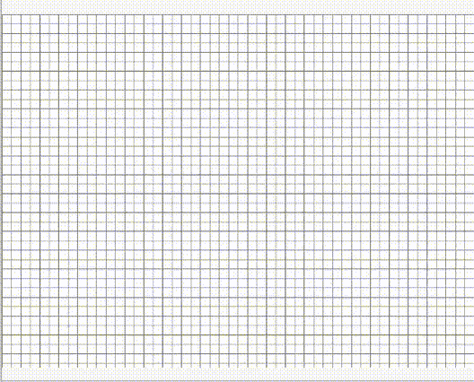

# aStarVisualizer
Visual demonstration of the A* pathfinding algorithm

Only dependency is pygame

Afther running the program,
Left click to place the start node then again to place the end node.
After those are placed you can now left click to add barriers
Right click removes nodes
Pressing "c" will clear the board
Pressing "q" will quit the game
